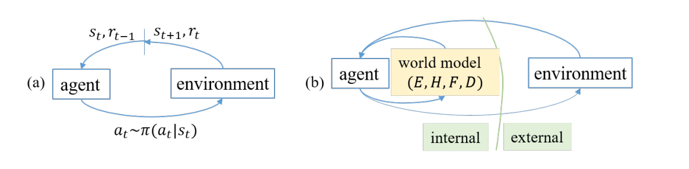
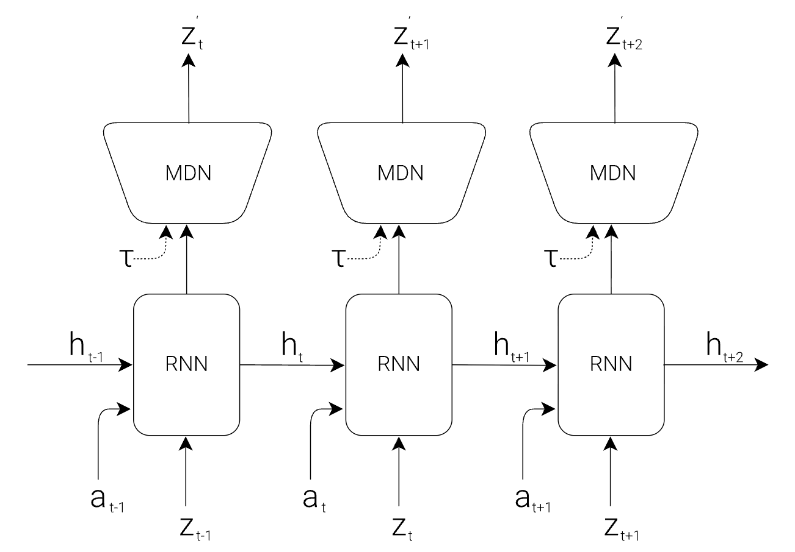
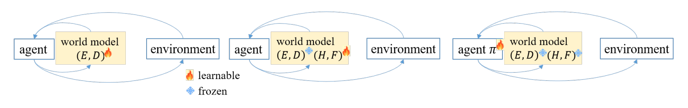
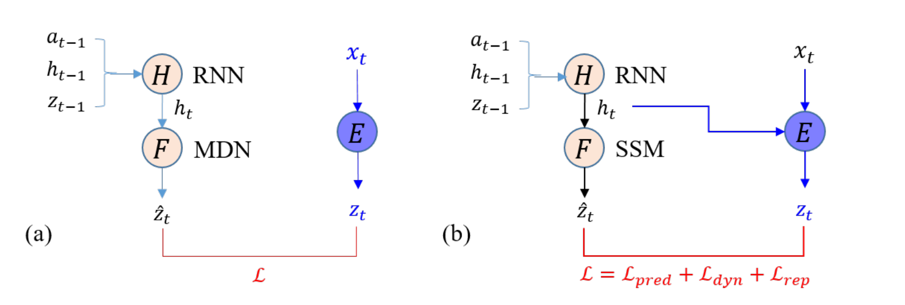
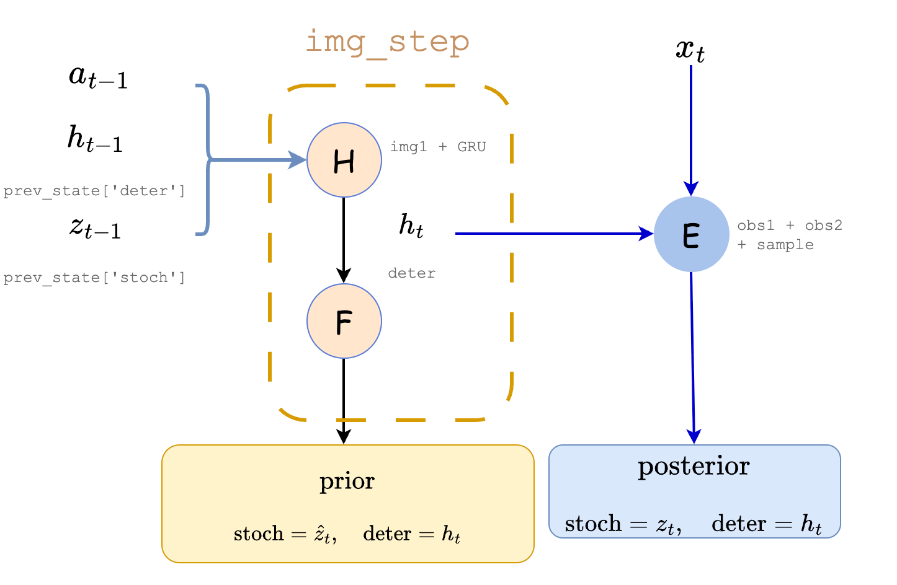

> **阅读说明：** 本文整理自 Il-Seok Oh 的论文 *A Tutorial on World Models and Physical AI* （发布于2026年8月，ACM Computing Surveys)

正如该论文的标题，这篇论文主要分为World Models 和 Physical AI 两部分。而World Models部分又分为Explicit World Model和Implicit World Model两个部分。这里主要整理其中Explicit World Model 的相关内容

## 核心构成
<figure>
  
  <figcaption>an agent equipped with a world model</figcaption>
</figure>

 - **Encoder(E):** 将从现实世界读取的信息转化为隐状态
 - **History State(H):** 储存历史信息
 - **Transition Model(F):** 隐状态下的动态转移，由于是在隐状态下计算，可泛化于各种任务，不局限于特定任务背景
 - **Decoder(D):** 输出人类可理解的结果（可选）

## Memoryless Latent World Models: The Ha–Schmidhuber Approach

先来看看最基础的，由David Ha and Jurgen Schmidhuber在2018年提出来的最基础版本：
### 模型结构

原始论文将整个项目结构分为VAE(V) Model, MDN-RNN (M) Model, Controller (C) Model 三部分，下图为MDN-RNN (M) Model的结构示意图：
<figure>
  
  <figcaption>RNN with a Mixture Density Network output layer. The MDN outputs the parameters of a mixture of Gaussian distribution</figcaption>
</figure>

此外，VAE(V) Model 即为由卷积神经网络搭建的encoder， Controller (C) Model 为一个简单的单层线性模型，在每个时间步骤中，将$z_t$和$h_t$直接映射为动作$a_t$。
$$
a_t=W_c[z_t|h_t]+b_c
$$

### 模型训练

<figure>
  
  <figcaption>Encoder-Decoder, Transition model 和 Controller 的分层训练</figcaption>
</figure>
如上图所示，该方法的模型训练总体分为三步，第一步训练Encoder和Decoder，Encoder先把输入转化为高维tensor，Decoder再把这个tensor还原为输入（分布的$\mu$和$\sigma$)。loss即定义为Encoder输入于Decoder输出的相似度。具体公式为$ \mathcal{L}=\mathcal{L_{construction}}+\mathcal{L_{KL} }$，其中$\mathcal{L_{KL}}$为KL散度，使得输出分布尽量接近$\mathcal{N}(0,1)$。


第二步为RNN-MDN神经网络的训练(如下图a所示)，此时将Decoder冻结，训练神经网络部分，其中RNN负责推断下一时刻的隐状态，MDN负责将其翻译为输出z的概率分布。loss则为在输出的分布之下真实z的似然。计算公式如下：


$$
\mathcal{L}_{\mathrm{MDN}}
= -\frac{1}{N}\sum_{n=1}^{N}
\log\left[
\sum_{k=1}^{K}
\pi_{n,k}
\frac{1}{\sqrt{2\pi}\sigma_{n,k}}
\exp\left(
-\frac{(y_n-\mu_{n,k})^2}{2\sigma_{n,k}^2}
\right)
\right]
$$


<figure>
  
  <figcaption>神经网络的loss计算</figcaption>
</figure>
 
## Contextual Latent World Models: The Dreamer Framework

不难发现，基础的Ha–Schmidhuber Approach有个明显的缺陷：Encoder不会被上下文影响，而根据常识我们知道，同样的现象在不同的上下文可能有不同的意义，The Dreamer Framework则尝试解决这一问题（参见上图）。

### 模型结构
<figure>
  
  <figcaption>dreamer的大致结构，论文原图缺失了一些细节，此处加以补充</figcaption>
</figure>

区别于前文的模型，Dreamer并没有单独的显式encoder，而是将其融入了RSSM框架（个人感觉不把它当作encoder其实更好理解）

```python
  @tf.function
  def img_step(self, prev_state, prev_action):
    x = tf.concat([prev_state['stoch'], prev_action], -1)
    x = self.get('img1', tfkl.Dense, self._hidden_size, self._activation)(x)
    x, deter = self._cell(x, [prev_state['deter']])
    deter = deter[0]  # Keras wraps the state in a list.
    x = self.get('img2', tfkl.Dense, self._hidden_size, self._activation)(x)
    x = self.get('img3', tfkl.Dense, 2 * self._stoch_size, None)(x)
    mean, std = tf.split(x, 2, -1)
    std = tf.nn.softplus(std) + 0.1
    stoch = self.get_dist({'mean': mean, 'std': std}).sample()
    prior = {'mean': mean, 'std': std, 'stoch': stoch, 'deter': deter}
    return prior
  
  @tf.function
  def obs_step(self, prev_state, prev_action, embed):
    prior = self.img_step(prev_state, prev_action)
    x = tf.concat([prior['deter'], embed], -1)
    x = self.get('obs1', tfkl.Dense, self._hidden_size, self._activation)(x)
    x = self.get('obs2', tfkl.Dense, 2 * self._stoch_size, None)(x)
    mean, std = tf.split(x, 2, -1)
    std = tf.nn.softplus(std) + 0.1
    stoch = self.get_dist({'mean': mean, 'std': std}).sample()
    post = {'mean': mean, 'std': std, 'stoch': stoch, 'deter': prior['deter']}
    return post, prior
```
在此贴一下核心代码作为参考。

```img_step```为prior的计算过程，```obs_step```调用```img_step```的输出计算post并继承其prior。初始```prev_state['stoch']```为空，先经过```img1```神经网络，在经过gru，随后再经过```img2 img3```，得到输出的均值与标准差，```stoch```根据输出的概率分布取样，与gru输出的```deter```组成prior。```obs_step```里将```img_step```里gru输出的```deter```与观测```embed```用两层神经网络整合，得到posterior。

此外，Dreamer还包含Decoder, Reward Head, Continue Head 三个组件，分别为将z,h转化为图像，reward，是否终止的简单神经网络，这里不再赘述。
### 模型训练
不同于前面模型的分层训练，Dreamer是整个系统一起训练。Loss的计算公式如下：
$$\mathcal{L}= \mathcal{L_{pred}}+\mathcal{L_{dyn}}+\mathcal{L_{rep}}+\mathcal{L_{reward}}+\mathcal{L_{cont}} $$
$\mathcal{L_{pred}}$与前面一样，是decoder结果与实际图像的差异；$\mathcal{L_{dyn}}$和$\mathcal{L_{rep}}$均为$prior$和$posterior$的KL散度，分别负责使先验预测靠近后验和防止后验远离先验，分开写是为了给他们不同权重。最后两项即为预测与实际reward,continue的偏离。

## 参考文献

Oh, Il-Seok. 2026. “A Tutorial on World Models and Physical AI.” *ACM Computing Surveys* 58 (4), Article 111, 35 pages.

Ha and Schmidhuber, "Recurrent World Models Facilitate Policy Evolution", 2018.