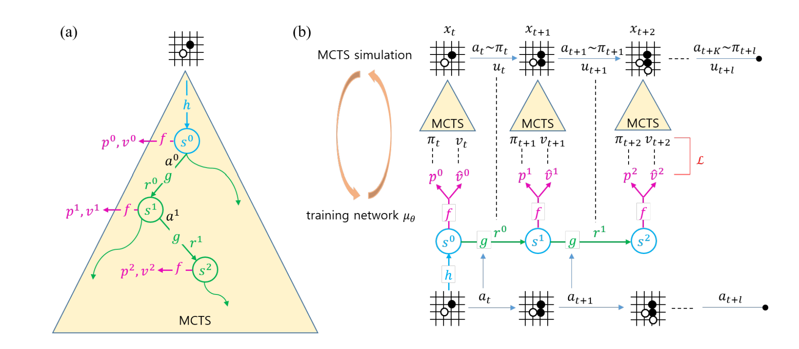
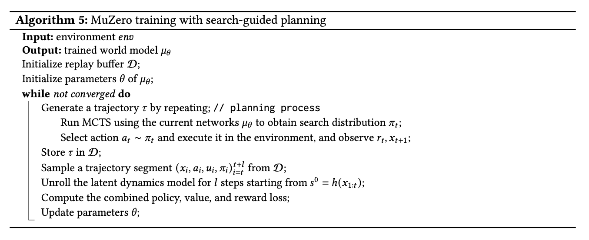

> **阅读说明：** 本文整理自 Il-Seok Oh 的论文 *A Tutorial on World Models and Physical AI* （发布于2026年8月，ACM Computing Surveys)

正如该论文的标题，这篇论文主要分为World Models 和 Physical AI 两部分。而World Models部分又分为Explicit World Model和Implicit World Model两个部分。这里主要整理其中Explicit World Model 的相关内容

## 核心构成
<figure>
  
  <figcaption>an agent equipped with a world model</figcaption>
</figure>

 - **Encoder(E):** 将从现实世界读取的信息转化为隐状态
 - **History State(H):** 储存历史信息
 - **Transition Model(F):** 隐状态下的动态转移，由于是在隐状态下计算，可泛化于各种任务，不局限于特定任务背景
 - **Decoder(D):** 输出人类可理解的结果（可选）

## Memoryless Latent World Models: The Ha–Schmidhuber Approach

先来看看最基础的，由David Ha and Jurgen Schmidhuber在2018年提出来的最基础版本：
### 模型结构

原始论文将整个项目结构分为**VAE(V) Model, MDN-RNN (M) Model, Controller (C) Model** 三部分，下图为MDN-RNN (M) Model的结构示意图：
<figure>
  
  <figcaption>RNN with a Mixture Density Network output layer. The MDN outputs the parameters of a mixture of Gaussian distribution</figcaption>
</figure>

此外，**VAE(V) Model** 即为由卷积神经网络搭建的encoder， **Controller (C) Model** 为一个简单的单层线性模型，在每个时间步骤中，将$z_t$和$h_t$直接映射为动作$a_t$。
$$
a_t=W_c[z_t|h_t]+b_c
$$

### 模型训练

<figure>
  
  <figcaption>Encoder-Decoder, Transition model 和 Controller 的分层训练</figcaption>
</figure>
如上图所示，该方法的模型训练总体分为三步，第一步训练Encoder和Decoder，Encoder先把输入转化为高维tensor，Decoder再把这个tensor还原为输入（分布的$\mu$和$\sigma$)。loss即定义为Encoder输入于Decoder输出的相似度。具体公式为$ \mathcal{L}=\mathcal{L_{construction}}+\mathcal{L_{KL} }$，其中$\mathcal{L_{KL}}$为KL散度，使得输出分布尽量接近$\mathcal{N}(0,1)$。


第二步为<strong>RNN-MDN(M)</strong>神经网络的训练(如下图a所示)，此时将Decoder冻结，训练神经网络部分，其中RNN负责推断下一时刻的隐状态，MDN负责将其翻译为输出z的概率分布。loss则为在输出的分布之下真实z的似然。计算公式如下：


$$
\mathcal{L}_{\mathrm{MDN}}
= -\frac{1}{N}\sum_{n=1}^{N}
\log\left[
\sum_{k=1}^{K}
\pi_{n,k}
\frac{1}{\sqrt{2\pi}\sigma_{n,k}}
\exp\left(
-\frac{(y_n-\mu_{n,k})^2}{2\sigma_{n,k}^2}
\right)
\right]
$$


<figure>
  
  <figcaption>神经网络的loss计算</figcaption>
</figure>
 
## Contextual Latent World Models: The Dreamer Framework

不难发现，基础的Ha–Schmidhuber Approach有个明显的缺陷：Encoder不会被上下文影响，而根据常识我们知道，同样的现象在不同的上下文可能有不同的意义，The Dreamer Framework则尝试解决这一问题（参见上图）。

### 模型结构
<figure>
  
  <figcaption>dreamer的大致结构，论文原图缺失了一些细节，此处加以补充</figcaption>
</figure>

区别于前文的模型，Dreamer并没有单独的显式encoder，而是将其融入了**RSSM**框架（个人感觉不把它当作encoder其实更好理解）

```python
  @tf.function
  def img_step(self, prev_state, prev_action):
    x = tf.concat([prev_state['stoch'], prev_action], -1)
    x = self.get('img1', tfkl.Dense, self._hidden_size, self._activation)(x)
    x, deter = self._cell(x, [prev_state['deter']])
    deter = deter[0]  # Keras wraps the state in a list.
    x = self.get('img2', tfkl.Dense, self._hidden_size, self._activation)(x)
    x = self.get('img3', tfkl.Dense, 2 * self._stoch_size, None)(x)
    mean, std = tf.split(x, 2, -1)
    std = tf.nn.softplus(std) + 0.1
    stoch = self.get_dist({'mean': mean, 'std': std}).sample()
    prior = {'mean': mean, 'std': std, 'stoch': stoch, 'deter': deter}
    return prior
  
  @tf.function
  def obs_step(self, prev_state, prev_action, embed):
    prior = self.img_step(prev_state, prev_action)
    x = tf.concat([prior['deter'], embed], -1)
    x = self.get('obs1', tfkl.Dense, self._hidden_size, self._activation)(x)
    x = self.get('obs2', tfkl.Dense, 2 * self._stoch_size, None)(x)
    mean, std = tf.split(x, 2, -1)
    std = tf.nn.softplus(std) + 0.1
    stoch = self.get_dist({'mean': mean, 'std': std}).sample()
    post = {'mean': mean, 'std': std, 'stoch': stoch, 'deter': prior['deter']}
    return post, prior
```
在此贴一下核心代码作为参考。

```img_step```为prior的计算过程，```obs_step```调用```img_step```的输出计算post并继承其prior。初始```prev_state['stoch']```为空，先经过```img1```神经网络，在经过gru，随后再经过```img2 img3```，得到输出的均值与标准差，```stoch```根据输出的概率分布取样，与gru输出的```deter```组成prior。```obs_step```里将```img_step```里gru输出的```deter```与观测```embed```用两层神经网络整合，得到posterior。

此外，Dreamer还包含Decoder, Reward Head, Continue Head 三个组件，分别为将z,h转化为图像，reward，是否终止的简单神经网络，这里不再赘述。
### 模型训练
不同于前面模型的分层训练，Dreamer是整个系统一起训练。Loss的计算公式如下：
$$\mathcal{L}= \mathcal{L_{pred}}+\mathcal{L_{dyn}}+\mathcal{L_{rep}}$$
$\mathcal{L_{pred}}$与前面一样，是decoder结果与实际图像的差异；$\mathcal{L_{dyn}}$和$\mathcal{L_{rep}}$均为$prior$和$posterior$的KL散度，分别负责使先验预测靠近后验和防止后验远离先验，分开写是为了给他们不同权重。

## Planning-Oriented Latent World Models: The MuZero Framework

MuZero其实有个非常著名的亲戚：AlphaGo。说白了，MuZero 其实就是AlphaGo在围棋以外的拓展。

### 模型结构
该系统大体分为两部分： **Latent World Model** 和 **Monte Carlo Tree Search (MCTS)**

先看前者，其实就是我们第一个提到的那个~~名字不会念的~~模型，不过这里符号表示和一些细节略有区别，还是大概说明一下。

$$
s^0 = h_\theta(x_{1:t}); \quad (r^k, s^k) = g_\theta(s^{k-1}, a^k); \quad (p^k, v^k) = f_\theta(s^k)
$$

这里的**Latent World Model**主要有三部分（如上述公式）。第一部分是表示函数$h_\theta$，输入到当前为止的观测历史$x_{1:t}$，输出初始隐状态$s^0$(其实就是Encoder)。第二部分是动力学函数$g_\theta$，输入上一步的隐状态$s^{k-1}$和当前尝试的动作$a^k$，输出即时奖励$r^k$和下一个隐状态$s^k$。第三部分是预测函数$f_\theta$，输入某个隐状态$s^k$，输出是策略先验$p^k$(一个向量，表示模型对从k出发选择这些action的建议程度)和价值估计$v^k$。其中$p^k$表示在当前隐状态下哪些动作更值得优先搜索，$v^k$则估计从这个状态继续走下去的长期回报。这三者共同构成了原文中称作$\mu_{\theta}$的神经网络系统。

接下来介绍**Monte Carlo Tree Search (MCTS)**：搜索树根即为当前局面，每到一个节点，系统便会计算其子节点的`ucb_score`（莫急，过会儿细说），并选出评分最高的子节点并重复上述步骤，直到抵达一个未访问过的节点。随后，我们对这个初见的节点进行拓展（用$f_{\theta}$得出此节点的$p和v$，并储存结果）。当上述操作完成一定次数后，我们考虑根节点的孩子们（也就是思考当前局面我们能进行哪些操作），将他们被访问的次数映射为概率，被访问次数越多的孩子被选择的概率越大，并根据得出的概率决定下一步的action。

接下来我们看看`ucb_score`，其计算公式如下：


$$
\begin{gathered}
score(p,c)=prior(p,c)+value(c) \\
value(c)=r(c)+\gamma v(c) \\
prior(p,c)=P(c)
\left(
  \log \frac{N(p)+c_{base}+1}{c_{base}}+c_{init}
\right)
\frac{\sqrt{N(p)}}{N(c)+1}
\end{gathered}
$$


~~嗯，我也觉得这个公式很恶心~~

我们先挑看起来相对人畜无害的$value$下手，它表示系统对该孩子当前价值的评估。$r(c)$为走到这个孩子时由$g$输出的即时收益，$v$则为神经网络$f$预测出的<u>沿着$c$方向继续探索预计会获得的平均收益</u>。接下来看$prior$（表示其潜力），注意到中间有一坨与$N(p)$成正比的式子，我们先设其为$K(p)$，将原式简化为$prior(p,c)=\frac{P(c)}{N(c)+1}K(p)$。$P(c)$为$f$对该子节点探索价值的先验估计；$N(c)$表示该child被访问的次数（次数多了就要把机会分给别人）；$K(p)$则就是一个与parent访问次数成正比的项，至于为什么设计成这样，我也不晓得，也许作者有些自己的考量吧（其实也有实现这里是直接用的$\sqrt{N(p)}$）。

然后看到这里就出现了一个令我百思不得其解的问题：**$K(p)$到底是干什么的？** 我们回忆一下这个`ucb_score`的作用——挑选同一个parent下接下来探索哪个child，也就是说比较时$K(p)$的值对于所有的child应该是一样的，那么它的意义何在？直接按原代码的公式还真不好理解，我们还得再重构一下上面的式子：

$$
score(p,c)=K(p)prior(c)+value(c)
$$

这样就好理解了，$K(p)$其实是prior的一个系数，当此parent访问次数足够多时，那些自身有价值的child（高$value$）应该已经被探索过很多次，这时我们就应该跟关注哪些没怎么被探索过($N(c)$小)，还具有潜力（高$prior$）的child。

<figure>
  
  <figcaption>muzero的大致结构，(a)为MCTS的搜索过程示意图(b)为整个系统的计算流程</figcaption>
</figure>

### 模型训练
<figure>
  
</figure>

大体流程结合上面的伪代码和示意图应该不难理解，这里就不再赘述~~应该不是想偷懒~~

但还是有必要大概说明一下目标数据从哪里来：
- **$\pi$：** 运行MCTS后得到的树根的孩子们的访问次数分布
- **$v$：** MCTS搜索过程中获取的，未来从环境获得的即时反馈$u$的均值
- **$u$：** 环境返回的即时反馈

原始论文loss公式：

$$
l_t(\theta)=\sum_{k=0}^{K} l^r(u_{t+k}, r_t^k)+l^v(z_{t+k}, v_t^k)+l^p(\pi_{t+k}, \mathbf{p}_t^k)+c\lVert\theta\rVert^2
$$


另外，实现中loss的计算均使用cross_entropy而非MAE，据说效果更好。

**【完】**


## 参考文献

Oh, Il-Seok. 2026. “A Tutorial on World Models and Physical AI.” *ACM Computing Surveys* 58 (4), Article 111, 35 pages.

Ha and Schmidhuber, "Recurrent World Models Facilitate Policy Evolution", 2018.

Danijar Hafner, Jurgis Pasukonis, Jimmy Ba, and Timothy Lillicrap. 2025. "Mastering Diverse Domains through World Models." *Nature* 640, 17 (April 2025), 647–665. doi:10.1038/s41586-025-08744-2

Schrittwieser et al., "Mastering Atari, Go, Chess and Shogi by Planning with a Learned Model", arXiv:1911.08265, 2019. https://arxiv.org/abs/1911.08265
