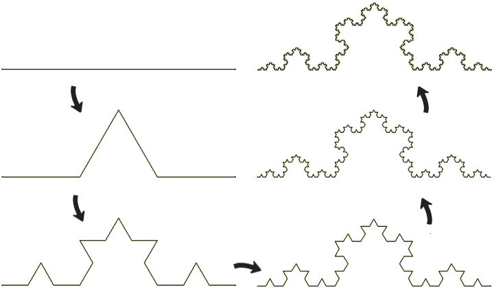
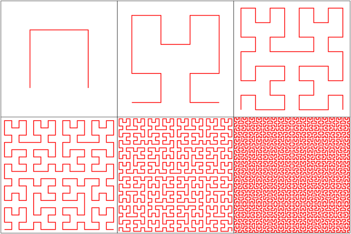
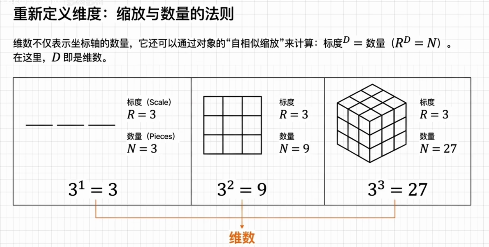
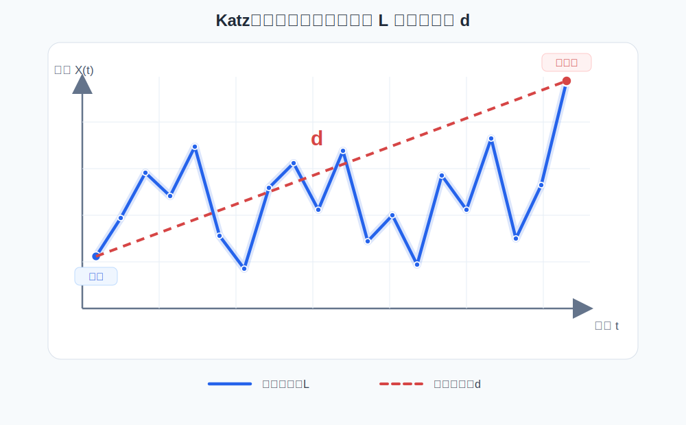

在传统几何中，我们习惯用整数维度来描述对象：直线是一维，平面是二维，空间是三维。这样的定义对规则图形非常自然，但当我们面对海岸线、山脉轮廓、云团边界，或者金融价格、脑电信号这类起伏不定的时间序列时，整数维度就显得不够用了。分形维度的出现，正是为了刻画这些介于规则与混沌之间的复杂结构。

## 从经典曲线到维度的重新定义

Koch曲线是理解分形维度的经典例子。它从一条线段开始，每次把线段三等分，并用一个向外凸起的等边三角形替换中间的一段。这个过程不断重复后，曲线的细节会越来越丰富，长度趋向无穷，但它仍然没有填满一个平面。

<figure>
  
  <figcaption>Koch曲线从线段开始，每一步都在局部添加新的折线结构，曲线长度不断增加，细节也不断变得复杂。</figcaption>
</figure>

这带来一个直接的问题：Koch曲线显然比普通线段更复杂，但它又没有像正方形那样占满二维区域。若仍然只用“一维曲线”或“二维平面”来描述它，就会丢失这种介于两者之间的复杂程度。

Peano曲线则把这种直觉挑战推得更远。它是一类空间填充曲线，可以通过连续映射把一维区间“填满”二维正方形。Koch曲线告诉我们，曲线的复杂程度可以超过普通的一维线段；Peano曲线进一步说明，仅凭“它是一条连续曲线”这个说法，已经不足以判断它在空间中的真实占据方式。

<figure>
  
  <figcaption>Peano曲线通过反复细分和折返，逐步逼近对二维区域的填充，展示了一维连续曲线与二维空间之间的反直觉关系。</figcaption>
</figure>

由此，维度需要被重新理解：它不仅表示对象所在空间的坐标数，也可以表示对象在不同观察尺度下呈现出的覆盖能力、空间占据程度和结构复杂性。

## 自相似分形的相似维数

重新理解维度，可以先从规则图形的“缩放与数量”关系开始。一个对象如果被缩小为原来边长的 $1/R$，并且需要 $N$ 个缩小后的相似副本才能拼回原来的对象，那么它的维度 $D$ 满足：

$$R^D=N,\quad D=\frac{\log N}{\log R}$$

这个公式在普通整数维度对象上同样成立。若把一条线段按比例 1/3 缩小，需要 3 个小线段拼回原来的长度，因此 $D=\log 3/\log 3=1$；若把一个正方形的边长缩小到 1/3，需要 $3^2=9$ 个小正方形覆盖原来的面积，因此 $D=\log 9/\log 3=2$；若把一个立方体的边长缩小到 1/3，则需要 $3^3=27$ 个小立方体填满原来的体积，因此 $D=\log 27/\log 3=3$。

<figure>
  
  <figcaption>整数维度中，尺度放大倍数 $R$ 与相似副本数量 $N$ 满足 $R^D=N$：线段对应 $3^1=3$，正方形对应 $3^2=9$，立方体对应 $3^3=27$。</figcaption>
</figure>

当这个思路用于自相似分形时，计算方式保持不变，只是结果可能不再是整数。以 Koch曲线为例，每一次迭代都会把一个整体分成 4 个缩小到原来 1/3 的相似部分。也就是说，这里 $R=3$，$N=4$，代入相似维数公式可得：

$$D = \frac{\log 4}{\log 3} \approx 1.262$$

这个数值说明 Koch曲线的复杂程度介于一维线段和二维平面之间。相似维数的意义就在于：它把“看起来更曲折、更复杂”这种直觉，转化成了一个可以计算的尺度指标。

## 分形维数的意义

分形维数的价值在于，它可以把“复杂”“粗糙”“不规则”这类直观描述转化为可计算的数量指标。

对于几何对象，分形维数越高，通常意味着对象在空间中占据得越充分，细节越丰富。例如一条平滑曲线的维数接近 1，而高度弯折、具有大量局部结构的曲线维数会大于 1。对于时间序列，分形维数可以反映序列图像的粗糙程度：波动越剧烈、局部变化越不规则，估计出的分形维数通常越高。

在数学建模中，分形维数常用于描述复杂系统的内在结构。它不直接预测未来数值，但可以作为特征指标参与分类、聚类、异常检测和状态识别。例如在生理信号分析中，脑电、心电等信号的分形维数可能反映系统活跃程度或病理状态；在金融时间序列中，价格走势的分形特征可以辅助分析市场波动和非线性结构；在工程监测中，振动信号的分形维数也可用于故障诊断。

## 时间序列中的常见分形维数方法

时间序列本身是一组按时间排列的数据点。把时间作为横轴、观测值作为纵轴后，序列可以看作一条曲线。对这条曲线估计分形维数，就可以得到一个衡量信号复杂度的指标。常见方法包括 Higuchi分形维数、Katz分形维数、Petrosian分形维数和关联维数。

这四种方法都试图回答同一个问题：时间序列中到底隐藏着怎样的复杂结构。但它们观察复杂性的角度不同。Higuchi方法关注不同时间尺度下曲线长度如何变化，Katz方法关注整条曲线的路径长度与空间跨度之间的关系，Petrosian方法关注局部方向变化的频繁程度，关联维数则从相空间中的点云结构理解系统的动力学复杂性。

### Higuchi分形维数

Higuchi分形维数，简称 HFD，是时间序列分析中非常常用的方法。它直接在一维时间序列上构造多个不同时间间隔的子序列，并估计不同尺度下曲线长度的变化规律。它的核心思想接近“换不同尺子量同一条曲线”：如果用更细的时间间隔观察时曲线长度明显增加，说明曲线在小尺度上存在更多起伏，分形维数也会更高。

设时间序列为 $X(1),X(2),\ldots,X(N)$。对每一个尺度 $k$，Higuchi方法会构造 $k$ 组子序列：

$$X_m^k: X(m),X(m+k),X(m+2k),\ldots,\quad m=1,2,\ldots,k$$

每一组子序列只取原序列中间隔为 $k$ 的点。随后计算这些子序列对应的归一化曲线长度 $L_m(k)$，再对所有起点 $m$ 求平均，得到尺度 $k$ 下的平均长度 $L(k)$。如果序列具有分形特征，$L(k)$ 与 $k$ 之间通常近似满足幂律关系：

$$L(k)\propto k^{-D}$$

因此，在实际计算中常把 $\log L(k)$ 对 $\log(1/k)$ 做线性拟合，拟合直线的斜率就作为 HFD 的估计值。斜率越大，说明曲线长度随观察尺度变化越敏感，序列越粗糙、越复杂。

HFD 的优点是能够较好地捕捉信号在多尺度上的复杂性，对非平稳信号也有一定适应性。因此它常用于脑电、心电、语音、振动等信号分析。它的主要参数是最大尺度 $k_{max}$：取值太小，尺度信息不足；取值太大，又可能让高尺度下的子序列点数过少，导致估计不稳定。实际建模时通常需要在固定采样率和固定窗口长度下调参，并保持训练集、验证集和测试集中的参数一致。

### Katz分形维数

Katz分形维数，简称 KFD，基于曲线总长度、序列起点到曲线上最远点的距离来估计复杂度。它的思想比较直观：如果一条曲线在相同范围内走了更长的路径，说明它更曲折，分形维数也更高。

对时间序列曲线来说，可以把相邻采样点之间的距离累加为曲线总长度 $L$。如果采样点为二维点 $(i,X(i))$，那么相邻两点的距离可以写成：

$$\operatorname{dist}_i=\sqrt{((i+1)-i)^2+(X(i+1)-X(i))^2}$$

实际实现中也常根据任务简化为只统计纵向变化。曲线总长度为：

$$L=\sum_{i=1}^{N-1}\operatorname{dist}_i$$

再计算起点到曲线上所有点的距离，其中最大值记为 $d$。Katz分形维数常写作：

$$D_{Katz}=\frac{\log(N)}{\log(d/L)+\log(N)}$$

这里 $N$ 是序列点数，$L$ 表示曲线实际走过的路径，$d$ 表示曲线从起点出发后达到的最大空间跨度。如果 $L$ 接近 $d$，说明路径比较直接，曲线接近平滑；如果 $L$ 远大于 $d$，说明曲线在有限范围内反复折返，复杂度更高。

<figure>
  
  <figcaption>Katz分形维数用曲线总长度 $L$ 和起点到曲线上最远点的距离 $d$ 描述折线的曲折程度：在跨度相近时，沿曲线逐段累加得到的 $L$ 越大，说明路径越弯折。</figcaption>
</figure>

KFD 的优势是计算简单、速度快，对短窗口也比较友好，适合在机器学习模型中作为轻量特征使用。它的局限也来自这种简洁性：KFD 对采样频率、序列长度、幅值尺度和归一化方式比较敏感。如果两个数据集的采样率不同，或者一个序列经过了幅值缩放，估计结果可能发生明显变化。因此在比较不同样本之前，通常需要统一窗口长度、采样率和标准化流程。

### Petrosian分形维数

Petrosian分形维数，简称 PFD，通常通过统计时间序列一阶差分符号变化的次数来刻画复杂度。它把复杂曲线的“弯折”简化为方向变化：如果序列的上升和下降频繁交替，说明局部波动更加密集。

具体做法是先计算一阶差分：

$$\Delta X(i)=X(i+1)-X(i)$$

然后统计差分序列中符号发生变化的次数，记为 $N_\Delta$。例如差分符号从正变负，或者从负变正，都可以看作一次符号变化。Petrosian分形维数的一种常见形式为：

$$D_{Petrosian}=\frac{\log(N)}{\log(N)+\log\left(\frac{N}{N+0.4N_\Delta}\right)}$$

其中 $N$ 是序列长度，$N_\Delta$ 是差分符号变化次数。符号变化越多，表示曲线局部转折越频繁，PFD 通常越高。与 HFD 关注多尺度长度不同，PFD 更像是在用一个快速的“转折计数器”概括序列的局部不规则性。

PFD 的计算效率很高，适合快速分析大量短序列，也适合在实时或近实时场景中作为初步复杂度指标。它在信号分类中经常作为轻量特征使用，例如区分不同状态下的生理信号片段。不过，由于 PFD 主要依赖符号变化次数，它会丢失很多幅值大小和多尺度结构信息；对于振幅差异很大但方向变化次数接近的序列，PFD 可能给出相似结果。因此它通常更适合作为辅助特征，而不是单独作为复杂系统结构的完整描述。

### 关联维数

关联维数来自非线性动力系统分析，常用于研究时间序列背后的吸引子结构。前面三种方法大多直接把时间序列看作平面上的曲线，而关联维数更关心：如果这组观测值来自某个动态系统，那么这个系统在隐藏状态空间中占据了多复杂的几何结构。

实际计算时，通常先进行相空间重构。对一维时间序列 $X(1),X(2),\ldots,X(N)$，选择嵌入维数 $m$ 和时间延迟 $\tau$，构造向量：

$$Y_i=(X(i),X(i+\tau),X(i+2\tau),\ldots,X(i+(m-1)\tau))$$

这样，一维序列就被转换为高维空间中的一组点。随后统计这些点之间的距离，并计算相关积分 $C(r)$，也就是距离小于半径 $r$ 的点对比例：

$$C(r)=\frac{2}{M(M-1)}\sum_{i<j} I(\|Y_i-Y_j\|<r)$$

其中 $M$ 是重构后向量的数量，$I(\cdot)$ 是指示函数：条件成立时取 1，否则取 0。如果系统存在分形吸引子，在合适的尺度范围内，相关积分与半径之间通常近似满足：

$$C(r)\propto r^{D_2}$$

因此，可以在双对数坐标下观察 $\log C(r)$ 与 $\log r$ 的线性关系，拟合斜率作为关联维数 $D_2$ 的估计值。直观地说，如果半径稍微增大就包含了大量新点，说明点云在空间中铺展得更充分，关联维数较高；如果点云主要集中在低维结构附近，关联维数则较低。

关联维数适合分析具有非线性动力学背景的时间序列，例如混沌系统、生理信号、流体或振动系统。它的解释力比单纯的曲线粗糙度更接近“系统状态空间的自由度”，但计算要求也更高。数据长度不足、噪声过强、嵌入维数 $m$、延迟 $\tau$ 和尺度区间选择不当，都会影响估计结果。实际使用时，关联维数通常需要和相空间重构、延迟选择、伪近邻分析等步骤配合，而不宜只把公式机械套到任意短序列上。

## 小结

分形维度把维度从整数几何推广到复杂结构的尺度描述。Koch曲线说明曲线可以拥有介于 1 和 2 之间的维度，Peano曲线进一步打破了一维曲线与二维区域之间的直觉边界，而 Hausdorff维数则为这种尺度复杂性提供了严格的数学定义。

在时间序列分析中，分形维数提供了一种观察信号复杂程度、粗糙程度和不规则程度的方式。HFD 更强调多尺度曲线长度变化，KFD 用路径曲折程度近似复杂性，PFD 通过符号变化快速刻画局部波动，关联维数则从动力系统角度分析隐藏状态空间的结构。它们不替代传统统计特征，而是为数学建模提供了另一组有解释力的非线性特征。
