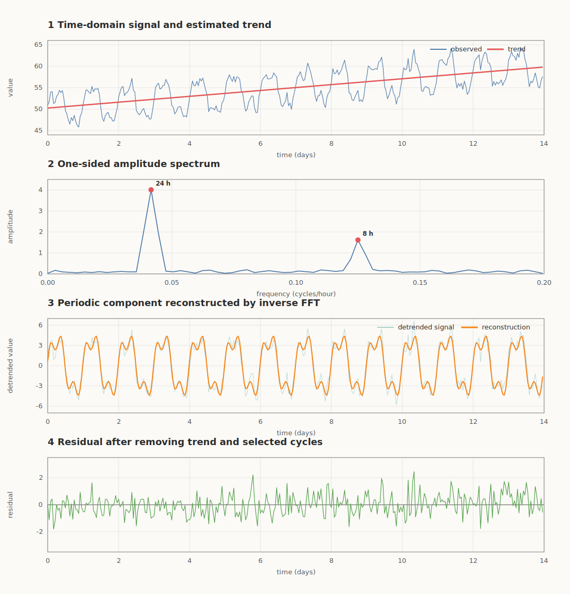

当一条时间序列上下波动时，我们通常先在时域中观察它：某一时刻的数值是多少，趋势是上升还是下降，什么时候出现了异常。但如果问题变成“这种波动是否在重复”“主要每隔多久重复一次”或“慢变化上叠加了哪些快速振荡”，只盯着时域曲线往往很难得到答案。

快速傅里叶变换（Fast Fourier Transform，FFT）提供了另一种视角：把一段按时间排列的数据，表示为一组不同频率的正弦和余弦波的组合。时域告诉我们“什么时候发生了什么”，频域则告诉我们“哪些变化速度最突出”。两种视角描述的是同一份数据，只是组织信息的方式不同。

## 先判断：什么时候应该使用 FFT

FFT 最适合的对象，是**等时间间隔采样的数值序列**，并且我们怀疑序列中存在重复波动或想要分离不同速度的变化。例如：

- 电力负荷中是否存在 24 小时和 7 天的周期；
- 机械振动中哪个频率的能量异常增强；
- 传感器数据中的快速抖动是信号还是高频噪声；
- 不同时间窗口的主要频率结构是否发生了变化；
- 建模前是否可以把频域幅值、主频和频带能量作为特征。

一个实用的判断方式是：**如果你的问题中出现了“周期”、“振荡”、“频率”、“滤波”或“频带能量”，FFT 通常值得尝试。**

但 FFT 并不适合所有时间序列问题。下表给出了一个更具体的选择边界。

| 想要解决的问题 | FFT 是否适合 | 原因或更合适的方法 |
| --- | --- | --- |
| 找出整段数据中的主要周期 | 适合 | 频谱峰值可以直接对应周期 |
| 分离低频变化和高频抖动 | 适合 | 可以选择频带后通过逆变换重构 |
| 判断某一次异常发生的具体时间 | 不充分 | FFT 会弱化时间位置信息，应回到时域或用短时傅里叶变换 |
| 频率随时间明显变化 | 不宜只用一次 FFT | 用 STFT、小波变换或分段分析 |
| 时间戳不规则、大量缺测 | 不能直接使用 | 先合理重采样，或考虑 Lomb–Scargle 周期图 |
| 解释一个变量对另一个变量的因果影响 | 不适合 | FFT 只描述频率结构，不自动给出因果 |
| 直接预测下一个数值 | 不是完整解决方案 | 可用频域特征或周期重构辅助预测，但仍需预测模型 |

## 时域与频域：同一条序列的两种表示

假设有一组长度为 $N$ 的离散时间序列：

$$x[0],x[1],\ldots,x[N-1]$$

时域图把采样时刻放在横轴，把观测值放在纵轴。它保留了数据发生的顺序，因此容易看出趋势、突变、异常点和波动范围。

离散傅里叶变换（Discrete Fourier Transform，DFT）则把序列转换为 $N$ 个频率系数：

$$X[k]=\sum_{n=0}^{N-1}x[n]e^{-j2\pi kn/N},\quad k=0,1,\ldots,N-1$$

每个 $X[k]$ 都是一个复数。它的模 $|X[k]|$ 表示该频率成分的强度，幅角 $\arg X[k]$ 表示相位，也就是该周期成分在时间轴上“从哪里开始”。逆离散傅里叶变换可以把这些系数原样合成为时域序列：

$$x[n]=\frac{1}{N}\sum_{k=0}^{N-1}X[k]e^{j2\pi kn/N}$$

DFT 是数学变换，FFT 是高效计算 DFT 的一类算法。直接计算 DFT 大约需要 $O(N^2)$ 次运算，典型 FFT 算法可以把复杂度降到 $O(N\log N)$。所以严格地说，“FFT 得到了频谱”是工程上的简称；实际完成变换的数学对象是 DFT。

### 频率、周期和采样率

如果采样率为 $f_s$，也就是每个时间单位采样 $f_s$ 次，第 $k$ 个 DFT 系数对应的频率为：

$$f_k=\frac{k f_s}{N}$$

频率的单位是“周期数/时间单位”。对于非零频率，周期是它的倒数：

$$T_k=\frac{1}{f_k}$$

例如，每小时采样一次时 $f_s=1$。如果频谱在 $f=1/24\approx0.0417$ 周/小时处出现峰值，就对应约 24 小时的周期。

数据总时长决定了可以分辨多细的频率差异。频率分辨率为：

$$\Delta f=\frac{f_s}{N}=\frac{1}{\text{总观测时长}}$$

想区分两个非常接近的长周期，需要更长的观测时间，而不是单纯地增加零填充。零填充会让频谱曲线看起来更平滑，却不会创造新的观测信息。

## FFT 在时间序列中的意义与功能

### 1. 发现隐藏的周期

一条序列可能同时含有日周期、周周期和更短的设备振荡。它们在时域中叠加后很难分辨，在频域中却可能表现为几个分离的峰。主频的倒数就是候选周期。

### 2. 分离不同时间尺度的变化

接近零频的成分变化很慢，往往与均值或趋势有关；较高频率的成分变化很快，可能对应局部振荡或噪声。在频域中保留目标频带、抑制其他频带，再使用逆 FFT 回到时域，就能得到相应的重构成分。

不过，“低频就是趋势、高频就是噪声”只是有条件的经验判断。快速冲击可能恰恰是需要保留的故障信号，缓慢漂移也可能是传感器误差。频带的含义必须结合业务和物理机制解释。

### 3. 滤波、去噪与信号重构

如果已知干扰集中在特定频率，可以在频域中设计低通、高通、带通或带阻操作。例如，电源工频干扰常集中在 50 Hz 或 60 Hz 附近，带阻滤波可以定向抑制它。实际工程中通常会使用设计完善的 FIR/IIR 滤波器，而不是简单地把某些 FFT 系数突然置零，因为过于尖锐的频域截断可能在时域产生振铃。

### 4. 构造可用于建模的频域特征

除了直接重构信号，还可以提取主频、主频幅值、频谱重心、频带能量、谐波比例和频谱熵等特征。这些特征常用于状态分类、故障诊断、异常检测和样本聚类。

### 5. 为后续模型提供结构线索

FFT 本身不是一个完整的时间序列预测模型，但它可以帮助确定季节长度，设计周期特征，或把周期成分与残差分开后再分别建模。在这个意义上，FFT 更像一个分析和特征工具，而不是“输入历史数据就自动输出未来”的黑箱。

## 一个标准的使用流程

把 FFT 用在时间序列中，不只是调用一个函数。一个较完整的流程通常包含以下步骤。

### 第一步：明确问题与单位

先明确要找周期、做滤波，还是提取特征。记录采样间隔 $\Delta t$ 和采样率 $f_s=1/\Delta t$。如果忘记采样间隔，频谱中的数字就无法被正确翻译为秒、小时或天。

### 第二步：检查并预处理数据

检查时间戳是否等间隔，是否有缺测、重复时间戳和极端异常点。根据问题处理缺测或重采样，再决定是否去均值、去趋势和标准化。

这一步很重要。强烈的均值对应 0 频率的大峰，强趋势会把能量堆积在低频区域，可能掩盖真正关心的周期。但去趋势也不是固定动作：如果研究的就是慢变化，就不能在不加思考的情况下把它删掉。

### 第三步：选择窗函数并计算 FFT

DFT 在计算时隐含了一个假设：所观察的数据片段会在片段之外周期重复。如果片段的首尾不连续，边界跳变就会把一个频率的能量扩散到周围频率，这称为**频谱泄漏**。

在计算 FFT 前乘以 Hann、Hamming 等窗函数，可以减小首尾跳变带来的泄漏。代价是主峰会变宽，幅值也需根据窗函数做校正。因此，窗函数是对泄漏、频率分辨能力和幅值误差之间的折中。

对实数序列，正频率和负频率信息共轭对称。NumPy 的 `rfft` 只返回不重复的非负频率部分，通常比直接使用 `fft` 更方便。

### 第四步：解读频谱

为每个 FFT 系数配置真实频率坐标，画出幅度谱或功率谱，然后查找显著峰值。幅度谱关心正弦成分的振幅，功率谱则更关心能量如何分布。不同软件的单边谱、双边谱和归一化约定可能不同，比较数值前必须确认定义。

一个频谱峰只表示“这个频率在数据中很强”，不等于它一定来自稳定的真实周期。趋势、有限样本、异常点和随机噪声都可能制造峰值。需要更稳健的频谱估计时，可以使用 Welch 功率谱；需要判断峰值是否超出噪声背景时，还应进行置信区间、置换检验或针对噪声模型的显著性检验。

### 第五步：重构并回到时域验证

如果目标是分解或滤波，可以保留目标频率或频带，再做逆 FFT 得到时域成分。但不要在频域图上找到两个峰就结束分析。还应把重构结果、原序列和残差放回时域，检查关键局部变化是否被保留，残差中是否仍有周期或结构。

## 简单例子：从小时数据中找出两个周期

下面构造 14 天的小时数据，共 $14\times24=336$ 个采样点。它包含四个部分：

$$x(t)=\text{基线与线性趋势}+\text{24 小时周期}+\text{8 小时周期}+\text{随机噪声}$$

真实数据中我们通常不知道周期的答案。这里主动加入两个已知周期，是为了检查整个流程能否把它们找回来。

```python
import numpy as np
import matplotlib.pyplot as plt

# 1. 构造数据：每小时一个样本，共 14 天
rng = np.random.default_rng(42)
fs = 1.0                         # 采样率：1 次/小时
n = 14 * 24
t = np.arange(n)

trend_true = 50 + 0.03 * t
daily = 4.0 * np.sin(2 * np.pi * t / 24)
eight_hour = 1.5 * np.sin(2 * np.pi * t / 8 + 0.5)
noise = rng.normal(0, 0.8, n)
y = trend_true + daily + eight_hour + noise

# 2. 去除线性趋势，避免低频能量掩盖周期
coef = np.polyfit(t, y, deg=1)
trend_hat = np.polyval(coef, t)
x = y - trend_hat

# 3. 乘 Hann 窗后计算单边 FFT
window = np.hanning(n)
spectrum = np.fft.rfft(x * window)
freq = np.fft.rfftfreq(n, d=1 / fs)  # 单位：周/小时

# 用窗函数的 coherent gain 校正幅值
amplitude = 2 * np.abs(spectrum) / window.sum()
amplitude[0] /= 2
if n % 2 == 0:
    amplitude[-1] /= 2

# 4. 找局部极大值，选振幅最大的两个峰
candidates = np.where(
    (amplitude[1:-1] > amplitude[:-2])
    & (amplitude[1:-1] > amplitude[2:])
)[0] + 1
dominant = candidates[np.argsort(amplitude[candidates])[-2:]]
dominant = dominant[np.argsort(amplitude[dominant])[::-1]]

for idx in dominant:
    print(
        f"frequency={freq[idx]:.4f} cycles/hour, "
        f"period={1 / freq[idx]:.2f} hours, "
        f"amplitude={amplitude[idx]:.2f}"
    )

# 5. 在未加窗的去趋势序列上保留主频，再逆变换
raw_spectrum = np.fft.rfft(x)
mask = np.zeros_like(raw_spectrum, dtype=bool)
mask[dominant] = True
periodic_hat = np.fft.irfft(np.where(mask, raw_spectrum, 0), n=n)
y_hat = trend_hat + periodic_hat
residual = y - y_hat

# 6. 在时域和频域同时检查结果
fig, axes = plt.subplots(4, 1, figsize=(10, 10), constrained_layout=True)
days = t / 24

axes[0].plot(days, y, lw=1, label="observed")
axes[0].plot(days, trend_hat, lw=2, label="estimated trend")
axes[0].set(ylabel="value", title="Time-domain signal and estimated trend")
axes[0].legend()

axes[1].plot(freq, amplitude, lw=1)
axes[1].scatter(freq[dominant], amplitude[dominant], color="crimson", zorder=3)
axes[1].set(
    xlim=(0, 0.2),
    xlabel="frequency (cycles/hour)",
    ylabel="amplitude",
    title="One-sided amplitude spectrum",
)

axes[2].plot(days, x, lw=0.8, alpha=0.55, label="detrended signal")
axes[2].plot(days, periodic_hat, lw=2, label="two-frequency reconstruction")
axes[2].set(ylabel="value", title="Periodic component reconstructed by inverse FFT")
axes[2].legend()

axes[3].plot(days, residual, lw=0.8)
axes[3].axhline(0, color="black", lw=0.8)
axes[3].set(xlabel="time (days)", ylabel="residual", title="Residual")

plt.show()
```

这段代码的典型输出为：

```text
frequency=0.0417 cycles/hour, period=24.00 hours, amplitude=4.01
frequency=0.1250 cycles/hour, period=8.00 hours, amplitude=1.62
```

<figure>
  
  <figcaption>合成序列中的趋势、24 小时周期和 8 小时周期。频谱中的两个主峰给出候选周期，保留对应 FFT 系数后可以通过逆变换重构周期部分。</figcaption>
</figure>

从这个例子可以看到，FFT 并不是把序列一键分成了“趋势、季节性和噪声”。趋势是我们在变换前用明确模型估计的；周期成分是根据频谱峰选出并重构的；残差则是原序列减去这些可解释成分后得到的。所谓“分解”包含了分析者对趋势模型、窗函数、频谱峰和频带边界的选择。

例子中 14 天刚好包含整数个 24 小时和 8 小时周期，所以频谱峰很干净。现实数据的周期往往不会恰好落在 FFT 的频率网格上，波动强度也会随时间变化，因此峰值可能变宽或分散到相邻频点。这时应该根据目标使用分段频谱、Welch 方法、STFT 或其他时频分析工具。

## 使用 FFT 时容易忽略的注意事项

### 采样必须规则

标准 FFT 默认相邻数据点的时间间隔相同。如果原始时间戳不规则，不能把它们当作等间隔数组直接输入 FFT。重采样和插值会改变频谱，因此必须记录方法，并检查插值是否人为创造了平滑或周期。

### 不要忽略奈奎斯特频率与混叠

采样率为 $f_s$ 时，离散数据能够无混叠表示的最高频率是奈奎斯特频率 $f_s/2$。高于它的真实振荡会被错认为较低频率，这称为混叠。混叠一旦进入已采样数据，通常不能靠事后 FFT 唯一恢复。解决方式是提高采样率，并在采样前使用抗混叠滤波。

### 数据长度决定低频分辨能力

要观察一个长周期，数据中应包含多个该周期。只有 8 天数据时，即使频谱中出现约 7 天的峰，也很难证明它是稳定周周期而不是一次慢变化。观测时长不足是信息问题，不是更换 FFT 库或增加零填充能解决的问题。

### 趋势、异常点和边界都会污染频谱

一个很强的异常尖峰包含很广的频率成分，可能让频谱整体抬高。首尾不连续会导致频谱泄漏，强趋势则会聚集低频能量。因此必须先看时域图，再决定异常处理、去趋势和加窗策略，而不应把 FFT 当成绕过数据清理的快捷方式。

### 整段 FFT 假设频率结构在窗口内大致稳定

对整段数据做一次 FFT，得到的是整个窗口的总体频率配方。它不能直接告诉我们某个频率是在第一天还是第十天出现。如果机器转速在中途改变，或某个周期只出现了一小段，整段 FFT 可能把它们平均为宽峰。这时需要滑动窗口、STFT 或小波方法来保留时间定位能力。

### 频谱峰不等于因果，也不一定等于季节性

峰值可能来自真实周期，也可能来自谐波、边界、窗函数、趋势或噪声。例如，一个非正弦形的日周期会在基频之外产生多个谐波峰，不应把每个峰都解释为独立的业务周期。频谱证据应和领域知识、分段稳定性检查以及时域回测一起使用。

### 建模时要防止未来信息泄漏

如果 FFT 特征用于预测或异常检测，每个时刻的特征只能由当时可见的历史窗口计算。若对包含未来样本的完整序列先做去趋势、标准化或 FFT，再切分训练集和测试集，就会把未来信息泄漏给模型，导致评估过度乐观。

## 如何把 FFT 与其他方法配合

FFT 解决的核心问题是“整段等间隔序列由哪些频率构成”。当问题超出这个范围时，可以选择对应的扩展或替代方法：

- 想得到更平稳的功率谱估计：使用 Welch 方法；
- 想知道频率在什么时候出现：使用 STFT 时频图；
- 想同时关注短暂高频和持续低频结构：考虑小波变换；
- 面对不规则采样数据：考虑 Lomb–Scargle 周期图；
- 需要明确的趋势、季节和残差分解：考虑 STL 等时域分解，并用 FFT 检查季节成分和残差；
- 需要预测：把 FFT 发现的周期用于构造傅里叶项、确定季节长度或生成特征，再与回归、ARIMA、状态空间或其他预测模型结合。

## 小结

FFT 的价值不在于创造了新信息，而在于把同一份时间序列换成了更适合回答频率问题的表示。它能帮助我们发现周期、比较频带能量、分离不同速度的变化、重构目标成分，并为后续分类、异常检测和预测提供特征。

一个可靠的 FFT 分析应该始于时域：先确认采样和数据质量，再处理均值、趋势和边界；它在频域中完成主要探索：检查峰值、频带和能量；最后还应回到时域：重构信号，检查残差，并确认结果是否符合业务和物理意义。

如果只记住一句话，可以记住：**当你想知道一条等间隔时间序列中“哪些重复速度最重要”时，使用 FFT；当你还想知道它们“什么时候出现”时，就需要把 FFT 与时域、滑动窗口或时频方法结合起来。**

## 延伸学习

如果希望进一步理解 FFT 算法本身，可以参考视频 [The Fast Fourier Transform (FFT): Most Ingenious Algorithm Ever?](https://youtu.be/h7apO7q16V0?si=HLRr8V5-I4uQRHhq)。该视频从多项式乘法、复数单位根、奇偶拆分和递归等角度，对快速傅里叶变换算法以及逆 FFT 的核心思想做了详细介绍。
